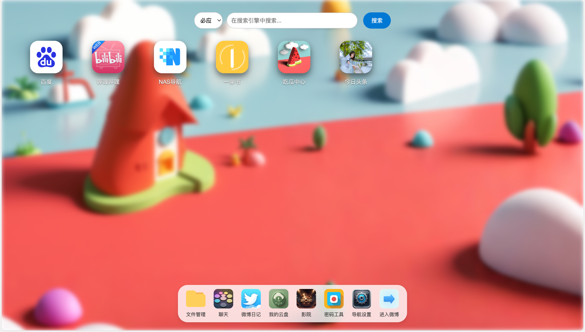
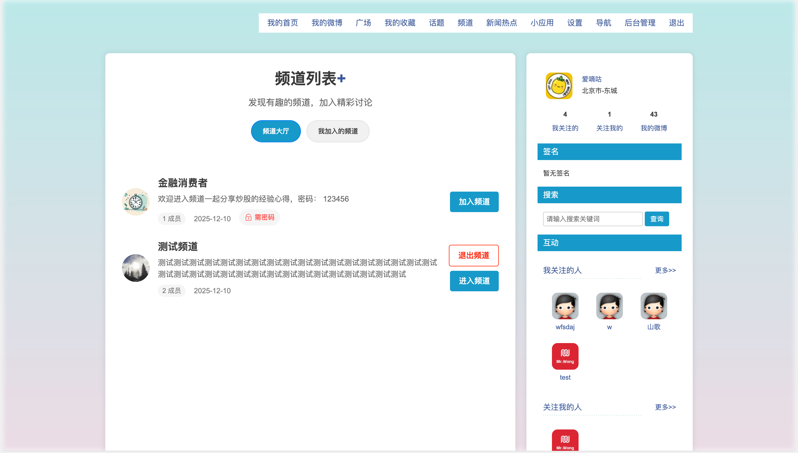
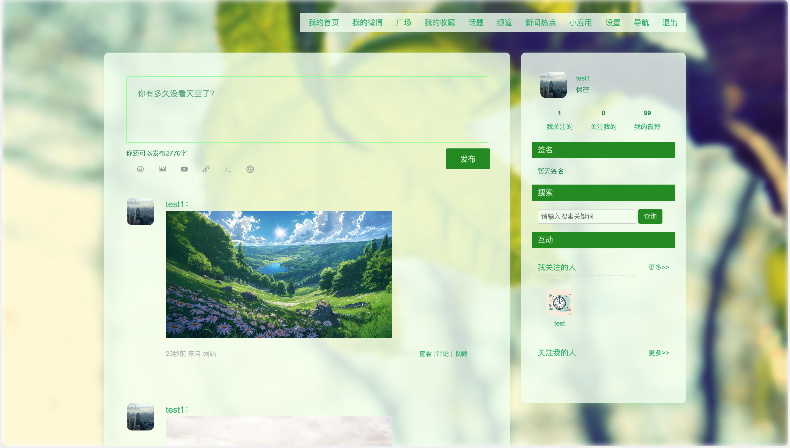
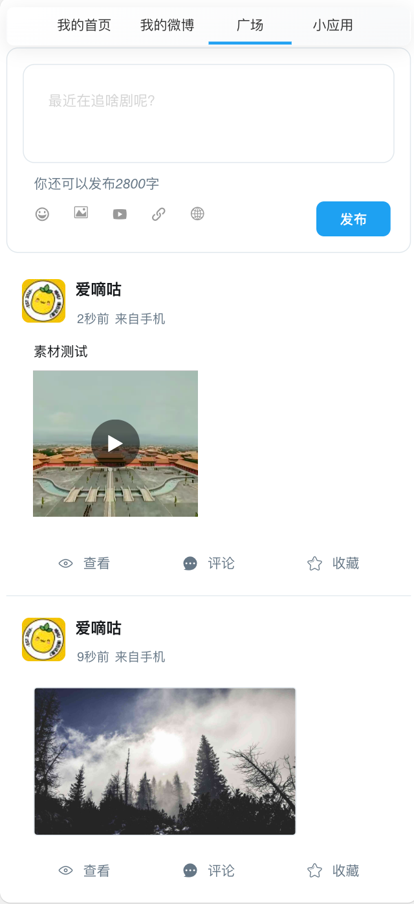

各位的朋友们：

本项目已经七年了，项目成立之初PHP还很火，原本想写个开源项目一是练练手二是能获得一些star。

但，近几年的AI发展实在太猛了，预计2026年AI会迎来再次爆发，随便一个AI工具，分分钟就能写出比爱嘀咕更高效、更智能的代码，

功能还更丰富。鉴于爱嘀咕这个项目，技术架构老旧，功能也跟不上时代，维护并没有意义。

因此本项目预计在2026年3月1日正式删除。

江湖再见！

### **主要功能特性**

- **微博发布**：用户可以发布文字、图片、视频等内容，支持表情符号
- **话题讨论**：创建和参与话题讨论，增加互动性
- **收藏功能**：收藏喜欢的内容，方便日后查看
- **即时聊天**：支持私信和群聊功能，实时沟通交流
- **频道系统**：创建不同类型的频道（普通、密码、邀请），组织特定群体交流
- **关注机制**：关注感兴趣的用户，获取其最新动态
- **导航系统**：提供便捷的网站导航功能
- **网盘服务**：个人云存储空间，支持文件上传和分享
- **搜索功能**：快速搜索内容、用户和话题
- **热搜榜单**：实时显示热门搜索和话题
- **文本阅读**：支持在线阅读文本内容

### **安装方式**

1.克隆源码，导入数据库即可

2.复制 example_env 为 .env 并修改.env相关配置

3.网站的运行目录设置为 /public

4.配置Web服务器的伪静态  

*Nginx伪静态配置（nginx.conf）*  

    location / {
    if (!-e $request_filename) {
        rewrite ^(.*)$ /index.php?s=/$1 last;
        break;
          }
    }

*Apache伪静态配置（.htaccess文件）*

    <IfModule mod_rewrite.c>
      Options +FollowSymlinks -Multiviews
      RewriteEngine On
      RewriteCond %{REQUEST_FILENAME} !-d
      RewriteCond %{REQUEST_FILENAME} !-f
      RewriteRule ^(.*)$ index.php?s=$1 [QSA,PT,L]
    </IfModule>

*IIS伪静态规则配置（web.config）*

    <?xml version="1.0" encoding="UTF-8"?>
      <configuration>
        <system.webServer>
          <rewrite>
             <rules>
                <rule name="OrgPage" stopProcessing="true">
                   <match url="^(.*)$" ></match>
                      <conditions logicalGrouping="MatchAll">
                         <add input="{HTTP_HOST}" pattern="^(.*)$" ></add>
                            <add input="{REQUEST_FILENAME}" matchType="IsFile" negate="true" ></add>
                       <add input="{REQUEST_FILENAME}" matchType="IsDirectory" negate="true" ></add>
                    </conditions>
                 <action type="Rewrite" url="index.php/{R:1}" ></action>
              </rule>
            </rules>
         </rewrite>
      </system.webServer>
    </configuration>
    
### **建议的环境：**

***Linux系统***：CentOS7+/Debian9+/Ubuntu20.04+  

***PHP版本需求***：建议PHP7.2+（暂不支持PHP8）  

***MySQL版本需求***：MySQL5.6+

## 预览图

  

## 版权信息

**本项目遵循** ***MIT License***